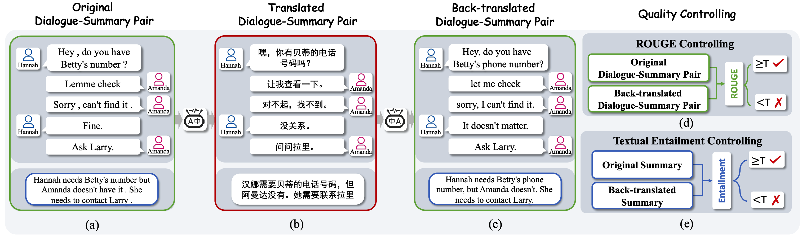
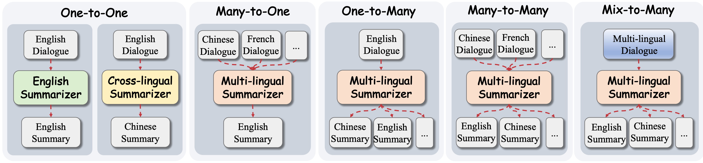
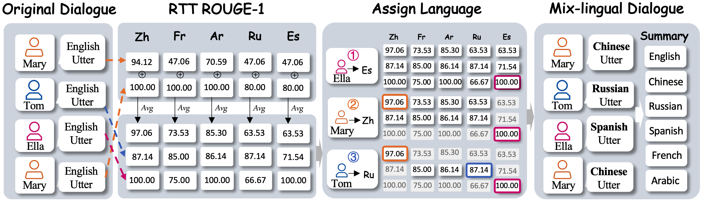

# MSAMSum: Multi-lingual Dialogue Summarization Dataset
This repository contains the dataset for our paper [MSAMSum: Towards Benchmarking Multi-lingual Dialogue Summarization](https://aclanthology.org/2022.dialdoc-1.1/).

* [1. Abstract](#1-abstract)
* [2. Dataset Construction](#2-dataset-construction)
* [3. Multi-lingual Settings](#3-multi-lingual-settings)
  + [3.1 Mix-lingual Setting](#31-mix-lingual-setting)
* [4. MSAMSum](#4-msamsum)
* [5. Recommendation](#5-recommendation)
* [6. Citation](#6-citation)
* [7. License](#7-license)


## 1. Abstract
`Dialogue summarization` helps users capture salient information from various types of dialogues has received much attention recently. 
However, current works mainly focus on English dialogue summarization, leaving other languages less well explored. 
Therefore, `we present a multi-lingual dialogue summarization dataset, namely MSAMSum, which covers dialogue-summary pairs in six languages.` 
Specifically, we derive MSAMSum from the standard SAMSum using sophisticated translation techniques and further employ two methods to ensure the integral translation quality and summary factual consistency. 
Given the proposed MSAMum, `we systematically set up five multi-lingual settings for this task, including a novel mix-lingual dialogue summarization setting.` 
To illustrate the utility of our dataset, we benchmark various experiments with pre-trained models under different settings and report results in both supervised and zero-shot manners. 
We also discuss some future works towards this task to motivate future researches.

## 2. Dataset Construction
Illustration of our data construction process.
<p align="center">

</p>

## 3. Multi-lingual Settings
Illustration of different multi-lingual settings.
<p align="center">

</p>

### 3.1 Mix-lingual Setting
Illustration of the mix-lingual dialogue construction process.
<p align="center">

</p>


## 4. MSAMSum
For MSAMSum please send an application email to `xiachongfeng1996[at].gmail.com` to obtain it. 
Note that, we cannot directly release the share link of MSAMSum due to the [CC BY-NC-ND 4.0](./CC-BY-NC-SA-4.0.md) license of original SAMSum dataset.


## 5. Recommendation
We also kindly recommend two highly related great papers for cross-lingual dialogue summarization research:
* [ClidSum: A Benchmark Dataset for Cross-Lingual Dialogue Summarization](https://arxiv.org/abs/2202.05599) [[code && data]](https://github.com/krystalan/ClidSum)
* [The Cross-lingual Conversation Summarization Challenge](https://arxiv.org/abs/2205.00379)

## 6. Citation
If you find this work is useful or use the data in your work, please consider cite our paper as well as the [SAMSum](https://arxiv.org/abs/1911.12237) paper:
```
@inproceedings{feng-etal-2022-msamsum,
    title = "{MSAMS}um: Towards Benchmarking Multi-lingual Dialogue Summarization",
    author = "Feng, Xiachong  and
      Feng, Xiaocheng  and
      Qin, Bing",
    booktitle = "Proceedings of the Second DialDoc Workshop on Document-grounded Dialogue and Conversational Question Answering",
    month = may,
    year = "2022",
    address = "Dublin, Ireland",
    publisher = "Association for Computational Linguistics",
    url = "https://aclanthology.org/2022.dialdoc-1.1",
    pages = "1--12"
}

@inproceedings{gliwa2019samsum,
  title={SAMSum Corpus: A Human-annotated Dialogue Dataset for Abstractive Summarization},
  author={Gliwa, Bogdan and Mochol, Iwona and Biesek, Maciej and Wawer, Aleksander},
  booktitle={Proceedings of the 2nd Workshop on New Frontiers in Summarization},
  pages={70--79},
  year={2019}
}
```
## 7. License
[CC BY-NC-SA 4.0](./CC-BY-NC-SA-4.0.md)
